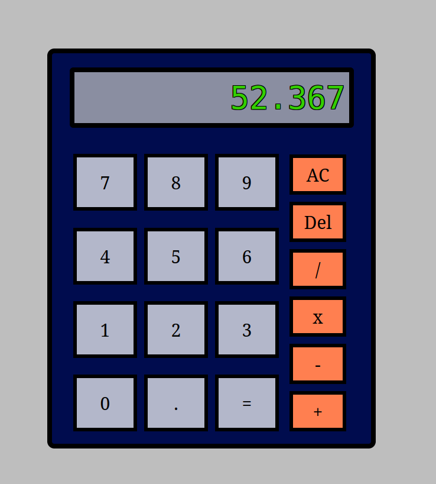

# TOP_Calculator

This project is part of the Foundations course from The Odin Project. The goal is to build a fully functional calculator using HTML, CSS, and JavaScript, as a way to practice DOM manipulation and basic programming logic.

🚀 Objective

Create a simple web-based calculator capable of performing the four basic arithmetic operations: addition, subtraction, multiplication, and division. This project helps reinforce concepts such as:

    Structuring content with HTML

    Styling with CSS

    DOM manipulation with JavaScript

    Event handling and control flow

    Writing clean and modular code

🛠️ Features

    Clean and responsive UI with clickable buttons

    Basic operations: +, −, ×, and ÷

    Clear button (C) and backspace/delete (←)

    Support for decimal numbers

    Error handling (e.g., division by zero)

💻 Technologies Used

    HTML5

    CSS3

    JavaScript (ES6)

📸 Screenshot 
    

📁 Project Structure

    calculator/
    ├── index.html
    ├── style.css
    └── script.js

▶️ How to Run

    Clone or download the project to your local machine:

        git clone https://github.com/your-username/calculator.git

    Navigate into the project folder:

        cd calculator

    Open index.html in your browser:

        You can simply double-click the index.html file, or

        Right-click it and choose "Open with" → your browser of choice

    ✅ No installation or build tools required – it’s pure HTML, CSS, and JavaScript.

📚 What I Learned

    How to structure a simple web application using vanilla JavaScript

    The importance of separating logic from UI

    Handling user input and updating the DOM in real-time

    Managing internal state and logic for chained operations